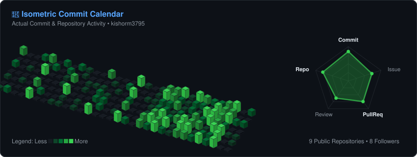

<!-- Header Top Banner -->

  

<!-- Profile Overview & Links Table -->
<table width="100%">
<tr>
<td width="50%" valign="top">
<h3 align="left">👤 Profile & Overview</h3>

<b>Pavan Kishor M</b> &nbsp;|&nbsp; <code>@kishorm3795</code> 
<i>Aspiring Software Engineer | ML Enthusiast</i> 
Building solutions that make an impact.

📍 <b>Location:</b> India 
🎓 <b>Education:</b> Computer Science Engineering 
📅 <b>Joined GitHub:</b> Aug 2023 
👥 <b>Followed by:</b> 128 users

</td>
<td width="50%" valign="top">
<h3 align="left">🌐 Portfolio & Links</h3>

🌐 <b>Portfolio:</b> <a href="https://kishorm3795.github.io/" target="_blank">kishorm3795.github.io</a> 
📷 <b>Instagram:</b> <a href="https://www.instagram.com/pavan_kishor.m/?hl=en" target="_blank">@pavan_kishor_m</a> 
💼 <b>LinkedIn:</b> <a href="https://www.linkedin.com/in/pavan-kishor-m-8ba028373/" target="_blank">linkedin.com/in/pavan-kishor-m</a> 
👁️ <b>Profile Views:</b> 

<table width="100%">
<tr>
<td align="center"><b>33</b> Repos</td>
<td align="center"><b>616</b> Contribs</td>
<td align="center"><b>1956</b> Stars</td>
<td align="center"><b>397</b> PRs</td>
</tr>
</table>
</td>
</tr>
</table>

  

<!-- Isometric Commit Calendar & Radar Chart -->
<h3>📅 Isometric Commit Calendar & Radar Chart</h3>

  

<!-- Tech Stack Matrix -->
<h3>🛠️ Tech Stack</h3>
<table width="100%">
<tr>
<td width="20%" align="left"><b>Languages</b></td>
<td align="left"></td>
</tr>
<tr>
<td align="left"><b>Frontend</b></td>
<td align="left"></td>
</tr>
<tr>
<td align="left"><b>Backend</b></td>
<td align="left"></td>
</tr>
<tr>
<td align="left"><b>Tools</b></td>
<td align="left"></td>
</tr>
</table>

  

<!-- Most Used Languages & Sports Fitness -->
<table width="100%">
<tr>
<td width="50%" valign="top">
<h3 align="left">📊 Most Used Languages</h3>
<table width="100%">
<tr>
<td align="left">🔹 <b>TypeScript</b></td>
<td align="right">73.3k lines (2.69 MB) — <b>47.32%</b></td>
</tr>
<tr>
<td align="left">🟡 <b>JavaScript</b></td>
<td align="right">58.5k lines (2.99 MB) — <b>52.68%</b></td>
</tr>
</table>
 
<table width="100%">
<tr>
<td align="center"><b>34</b> Repositories</td>
<td align="center"><b>3672</b> Commits</td>
<td align="center"><b>14349</b> Files Changed</td>
<td align="center"><b>23</b> PRs Merged</td>
</tr>
</table>
</td>
<td width="50%" valign="top">
<h3 align="left">⚽ Sports & Fitness</h3>

🏏 <b>Cricket</b> <i>(Passion)</i> &nbsp;|&nbsp; 🏸 <b>Badminton</b> <i>(Weekly)</i> 
🏋️ <b>Gym</b> <i>(Strength)</i> &nbsp;|&nbsp; 🏃 <b>Running</b> <i>(5K+)</i>

 
<blockquote style="margin: 0; padding: 8px;">
<i>"Discipline in code. Dedication in sport. Consistency in life."</i> 🏃‍♂️
</blockquote>
</td>
</tr>
</table>

  

<!-- Footer Banner -->

